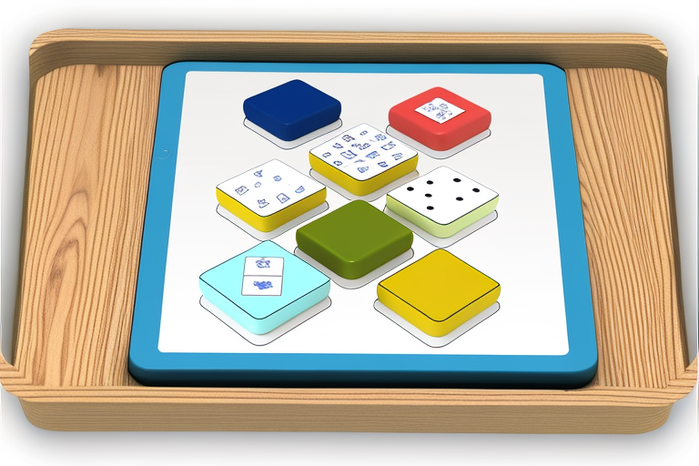

# 🔵 Montessori items for Collboard

<!--Badges-->
<!--⚠️WARNING: This section was generated by https://github.com/hejny/batch-project-editor/blob/main/src/workflows/800-badges/badges.ts so every manual change will be overwritten.-->

<!---->
<!---->

<!--/Badges-->

Montessori tray module for [Collboard.com](https://collboard.com/) created via [@collboard/modules-sdk](https://www.npmjs.com/package/@collboard/modules-sdk).

<!--Wallpaper-->
<!--⚠️WARNING: This section was generated by https://github.com/hejny/batch-project-editor/blob/main/src//workflows/315-ai-generated-wallpaper/4-aiGeneratedWallpaperUseInReadme.ts so every manual change will be overwritten.-->

<!--/Wallpaper-->

<!--Partners-->
<!--⚠️WARNING: This section was generated by https://github.com/hejny/batch-project-editor/blob/main/src/workflows/820-partners/partners.ts so every manual change will be overwritten.-->

## ✨ Partners

[Become a partner](https://www.pavolhejny.com/contact/)

<!--/Partners-->